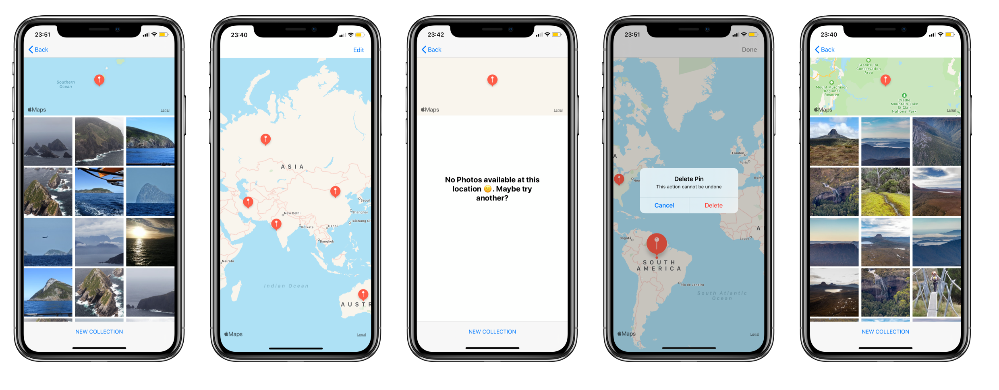

# Virtual-Tourist

## Udacity iOS Developer Nanodegree Program


```Swift
- Virtual Tourist Project
```

```
- This app downloads and stores images from Flickr.
-  users can drop pins on a map, as if they were stops on a tour. 
-  Users will then be able to download pictures for the location.
```

 ## Screenshots
 <p float="left">
       
 </p>


## Credits
Original graphical assets were provided by Udacity.
The concept for this app was presented during the iOS Nanodegree programme provided by Udacity.
